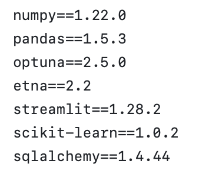
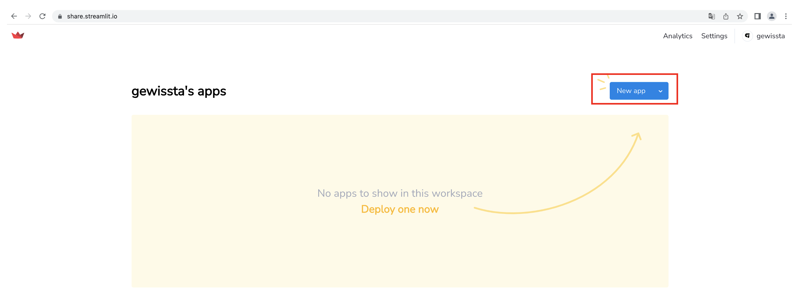
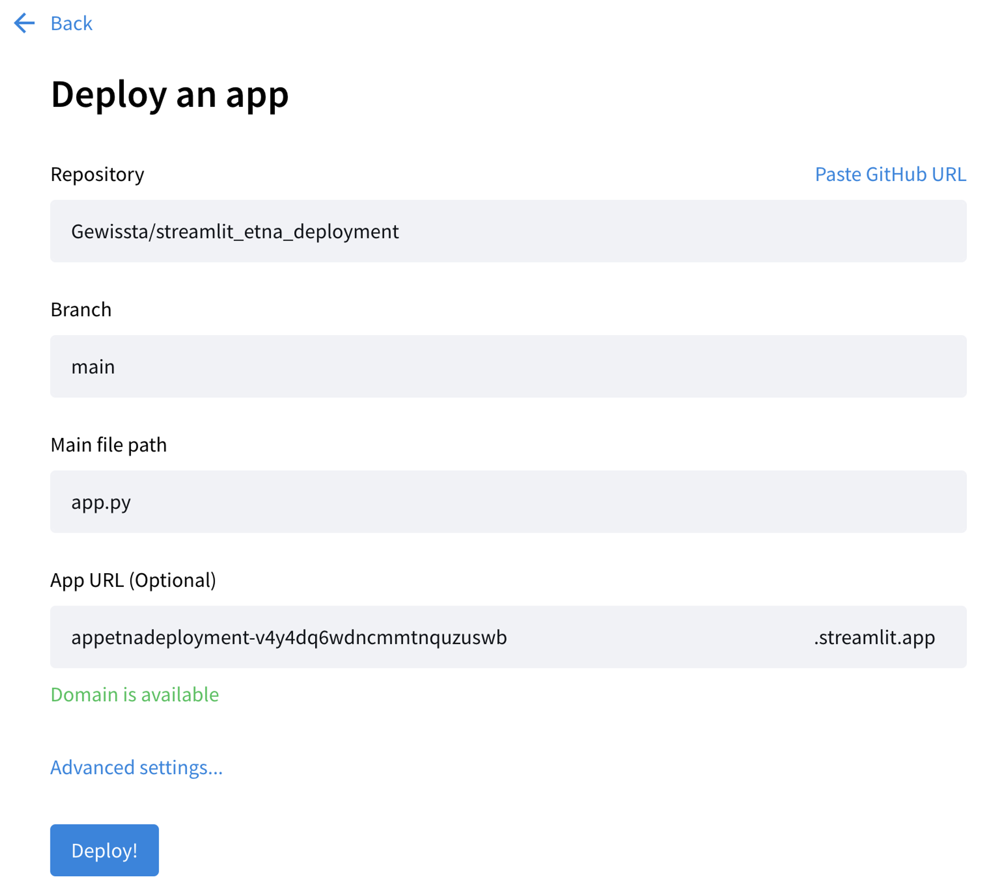
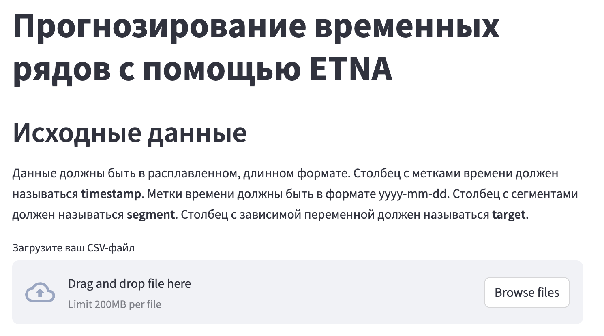

# Развертывание Streamlit-приложения "Прогнозирование временных рядов с помощью ETNA" в Streamlit Community Cloud

Мы можем развернуть наше приложение на облачной платформе **Streamlit Community Cloud**.
Создаем папку **streamlit_etna_deployment** и с помощью текстового редактора создадим в ней файл *requirements.txt* с версиями использованных библиотек.
Для нашего примера этот файл выглядит так:

Переходим в папку **streamlit_etna_deployment** и убеждаемся, что файл *requirements.txt* создан.

Переносим в папку файл приложения *app.py*.
Теперь на основе папки **streamlit_etna_deployment** создадим репозиторий на GitHub. Пример такого репозитория как раз здесь и приведен (https://github.com/Gewissta/streamlit_etna_deployment).
Откройте страницу по ссылке https://share.streamlit.io/, зарегистрируйтесь и подключите к платформе свой аккаунт на GitHub.
Войдя в систему, нажмите кнопку **New App**.

Найдите созданный ранее репозиторий GitHub, введя его имя **streamlit_etna_deployment** в строке **Repository**. Измените **Main file path** на **app.py**. Нажмите кнопку **Deploy!**.

Спустя некоторое время появится web-приложение. 
Вот пример такого приложения – https://appetnadeployment-v4y4dq6wdncmmtnquzuswb.streamlit.app/.

